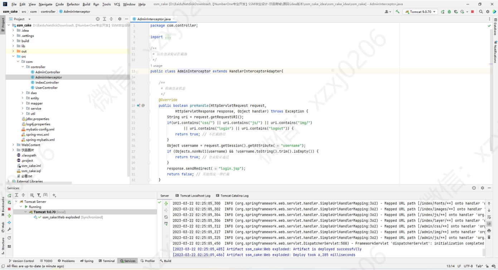
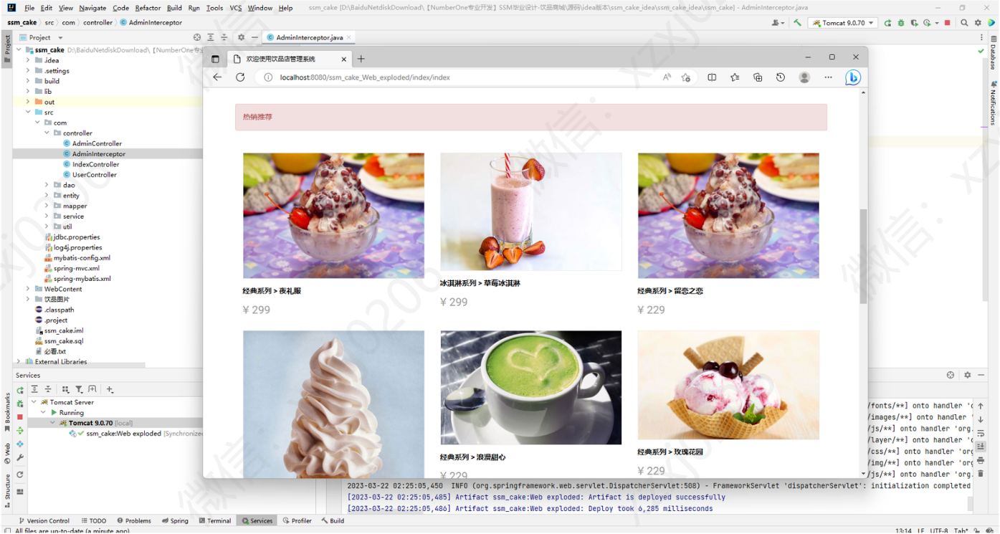

# 奶茶蛋糕销售管理系统

### 有问题，或者不会调试运行的同学, 可以添加微信（注明项目）：xzxj0206

## 一、介绍

饮品店（奶茶蛋糕店）销售管理系统

框架

(1) 后台: SpringMvc+Spring+Mybatis

(2) 前台: Jquery+Layer

## 二、系统运行界面

## 三、系统部分功能页面展示

### 用户部分功能页面

### 商家部分功能后台

