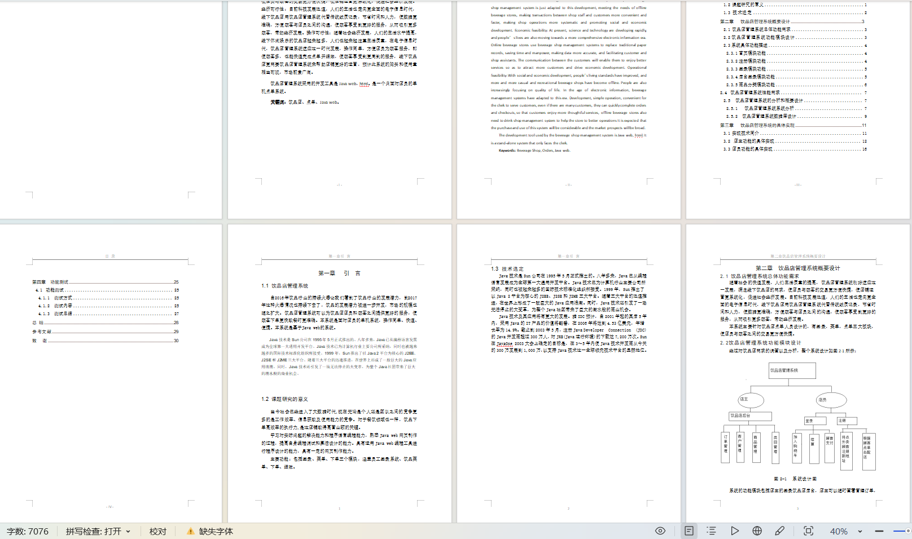
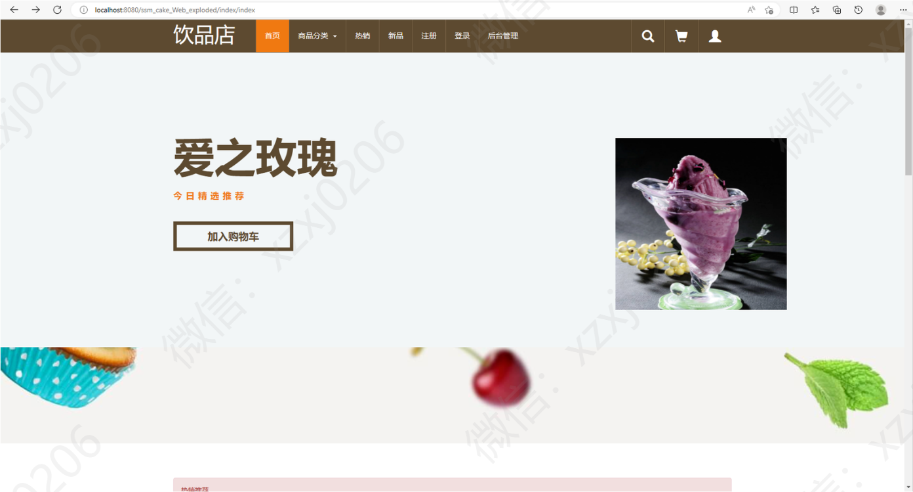
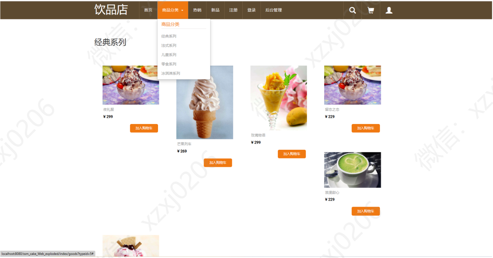
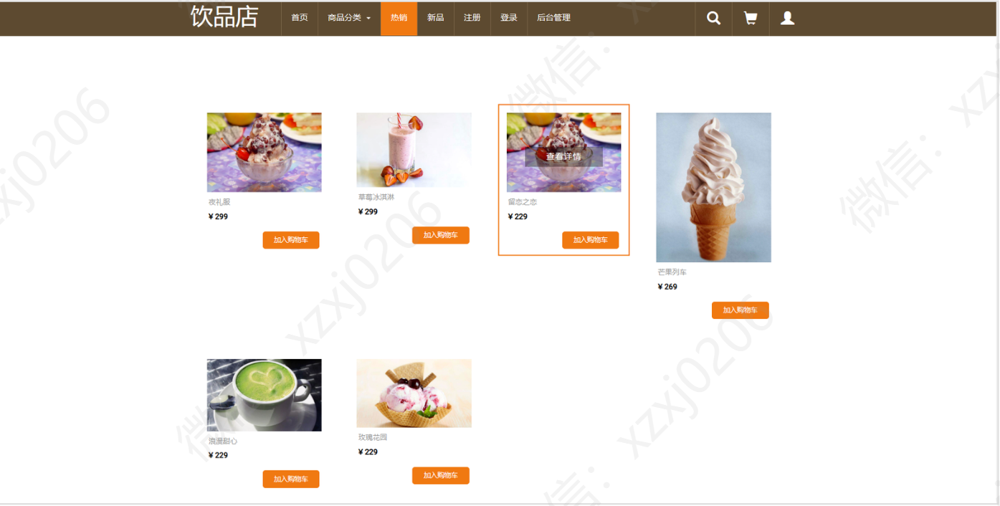
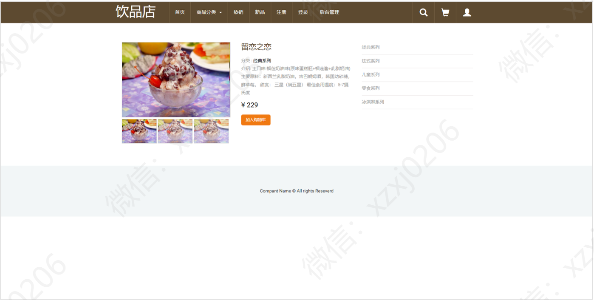
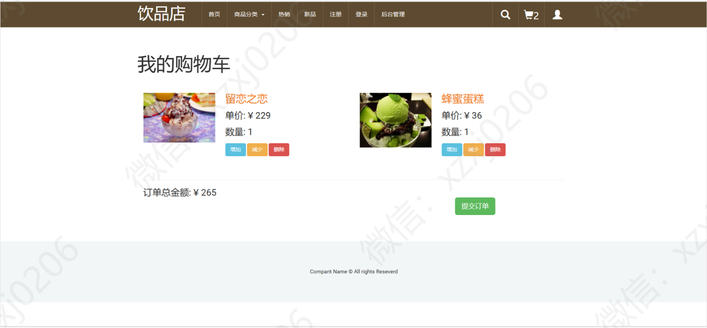
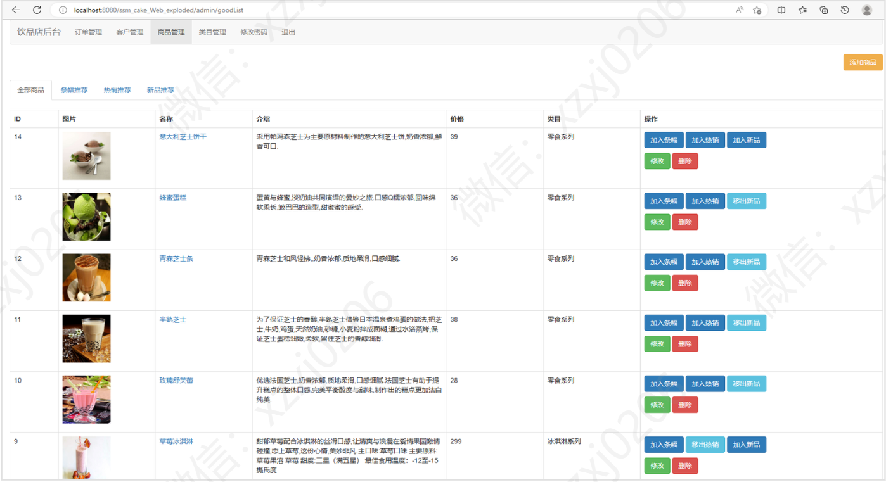

# 奶茶蛋糕销售管理系统

### 9.9￥ 获取完整源码+sql，附赠7000字报告文档，需要加Q：3577148218 ,备用Q: 3808981644
### 有问题，或者需要协助调试运行项目的也可联系
### 更多项目： https://github.com/34426?tab=repositories

## 一、介绍

饮品店（奶茶蛋糕店）销售管理系统

语言：java

运行工具：idea或eclipse 数据库：mysql

框架

(1) 后台: SpringMvc+Spring+Mybatis

(2) 前台: Jquery+Layer+Jsp

有用户和管理员两个角色

用户可进行注册，登录，查看商品列表，查看商品详情，加入购物车，购买商品等功能。

管理员有订单管理，用户管理，商品管理，分类管理等功能
## 二、7000字报告文档

## 三、系统部分功能页面展示

### 用户部分功能页面

### 商家部分功能后台

### 9.9￥ 获取完整源码+sql，需要加Q：3577148218 ,备用Q: 3808981644

